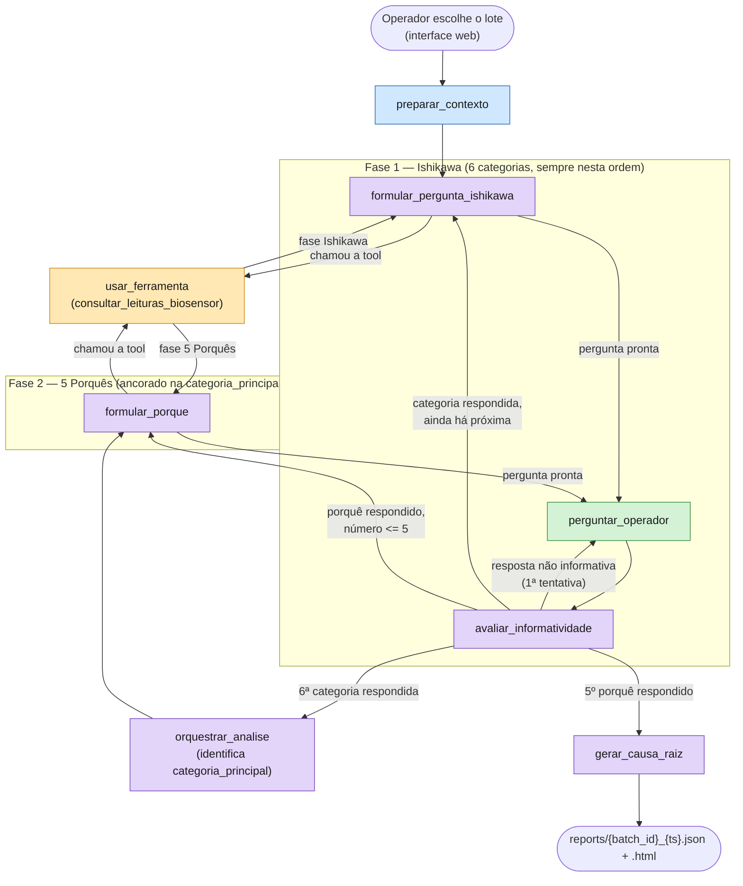
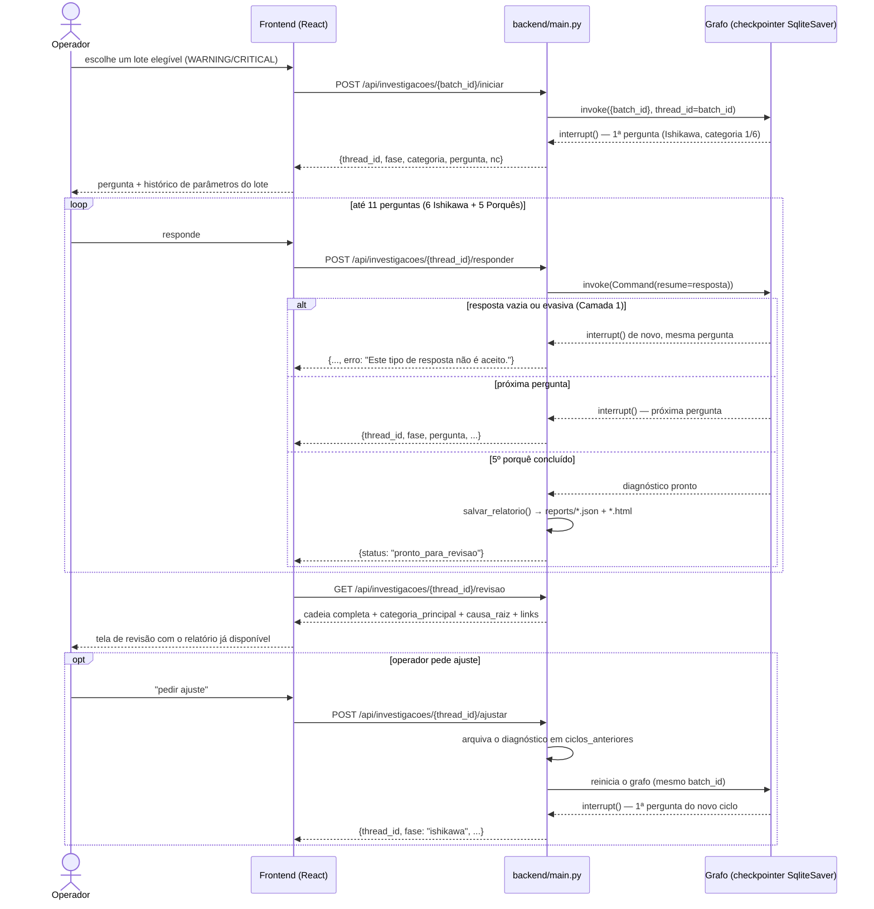

# Diagrama de fluxo — Root-Spector

Duas visões complementares do mesmo sistema: a topologia interna do grafo
LangGraph (`root_cause_agent/graph.py`) e a sequência de chamadas HTTP
entre operador, frontend e backend (`backend/main.py`). Ambas renderizam
nativamente no GitHub (Mermaid). Ver `docs/openapi.yaml` para o contrato
completo das rotas e `specs/design.md` para o detalhamento textual.

## 1. Grafo do agente (LangGraph)

Espelha exatamente os nós/arestas de `graph.py` — cores indicam o tipo de
cada nó (a mesma legenda usada em `docs/apresentacao.html`).

**Legenda:** azul = determinístico/workflow · roxo = agêntico (chama o
LLM) · amarelo = ferramenta · verde = human-in-the-loop (`interrupt()`).
`usar_ferramenta` é compartilhado pelas duas fases — `rotear_apos_ferramenta`
decide para onde voltar (`categoria_principal is None` → ainda em
Ishikawa). `avaliar_informatividade` é quem decide se a cadeia avança: se a
resposta não for informativa e ainda for a 1ª tentativa, volta para
`perguntar_operador` (2ª e última chance); caso contrário, registra a
resposta final e o roteamento (`rotear_apos_avaliar`) segue para a próxima
categoria, para `orquestrar_analise` (Ishikawa completo), para o próximo
porquê, ou para `gerar_causa_raiz` (5º porquê concluído).

## 2. Sequência operador ↔ frontend ↔ backend ↔ agente

**Nota — falha de LLM:** se todos os provedores configurados (Gemini →
Groq → Anthropic → OpenAI) falharem, `iniciar`/`responder`/`ajustar`
capturam `FalhaLLMError` e devolvem `HTTP 503` com "Serviço de IA
indisponível, recarregue a página." — o checkpoint do `thread_id`
permanece pausado no último ponto bem-sucedido (nenhum progresso é
perdido; ver `specs/design.md` § Tratamento de falha na chamada ao LLM).
